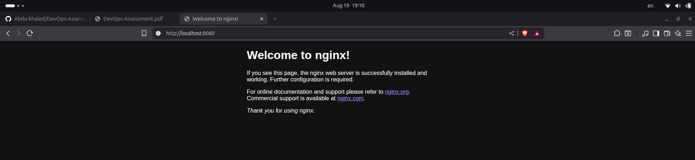

# DevOps-Assessment

## Task 1: File and Folder Management

- `Objective`: Create a directory structure for a new project.
  
**Command:**
```bash
mkdir project
mkdir project/src project/docs project/tests
touch project/src/main.py project/docs/README.md project/tests/test_main.py 
echo "This is a sample DevOps project for testing automation." > project/docs/README.md
tree project 
```

**Output:**  


## Setup environment and repo 

**Output:**  


## Task 2: Basic OS Configuration


- `Objective`: Configure the hostname of the Linux machine. 
  
**There are two way to change the hostname in the system one with `Reboot Required` two `No Reboot`**

### Change Hostname `No Reboot`

1. Check Current Hostname
**Command:**
```bash
# we can use:
hostname 
hostnamectl # for more info in my system
```

2. Use set-hostname to Change the Hostname

**Command:**
```bash
hostnamectl set-hostname devops-junior
```

**Output:**  


### **Change Hostname `Reboot Required`**

1. Open /etc/hostname and Change the Hostname

**Command:**
```bash
sudo vim /etc/hostname
```

2. Open /etc/hosts and Change the Hostname

**Command:**
```bash
#The file /etc/hosts maps hostnames to IP addresses
sudo vim/etc/hosts
```

3. Reboot the System

**Command:**
```bash
sudo systemctl reboot
```

**Output:**  


## Task 3: Simple Container Run 

- `Objective` : Run a basic web server container.

**Command:**
```bash
docker run -d --name mynginx -p 8080:80  nginx 
```

**Output:**  


**Output:**  



## Task 4: Basic Scripting

- `Objective`: Automate a simple task using a bash script.

**Command:**
```bash
#!/bin/bash


SOURCE_DIR=$1
DEST_DIR=$2
BACKUP_NAME="$(basename "$SOURCE_DIR").tar.gz"

# check the two arguments

if [ "$#" -ne 2 ];then
        echo "$0  <source_dir> <dest_dir>"
        exit 1
fi


# check if the source disectory exists or not

if [ ! -d "$SOURCE_DIR" ]; then
       echo "Error source '$SOURCE_DIR' does not exist."
       exit 1
fi

# create the destination 

mkdir -p "$DEST_DIR"

# create the backup 

tar -czf "$DEST_DIR/$BACKUP_NAME" -C "$(dirname "$SOURCE_DIR")" "$(basename "$SOURCE_DIR")"

echo "Backup of '$SOURCE_DIR' created at '$DEST_DIR/$BACKUP_NAME'"
```

