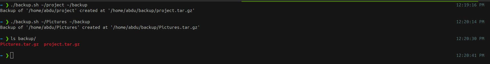
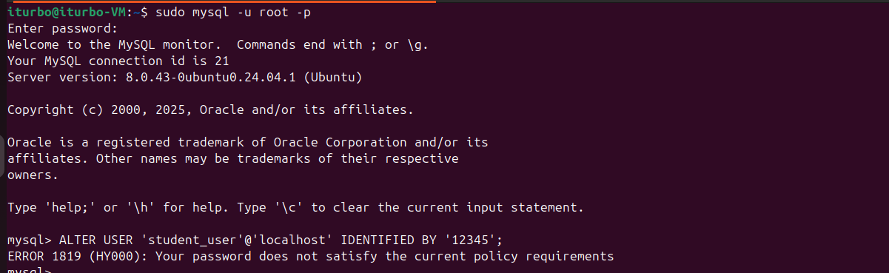

# DevOps-Assessment

## Task 1: File and Folder Management

- `Objective`: Create a directory structure for a new project.
  
**Command:**
```bash
mkdir project

mkdir project/src project/docs project/tests

touch project/src/main.py project/docs/README.md project/tests/test_main.py
 
echo "This is a sample DevOps project for testing automation." > project/docs/README.md

cat project/docs/README.md

tree project 
```

**Output:**  


## Setup environment and repo 

**Output:**  


## Task 2: Basic OS Configuration


- `Objective`: Configure the hostname of the Linux machine. 
  
**There are two way to change the hostname in the system one with `Reboot Required` two `No Reboot`**

### Change Hostname `No Reboot`

1. Check Current Hostname
**Command:**
```bash
# we can use:
hostname 
hostnamectl # for more info in my system
```

2. Use set-hostname to Change the Hostname

**Command:**
```bash
hostnamectl set-hostname devops-junior
```

**Output:**  


### **Change Hostname `Reboot Required`**

 #### 1. Open /etc/hostname and Change the Hostname

**Command:**
```bash
sudo vim /etc/hostname
```

#### 2. Open /etc/hosts and Change the Hostname

**Command:**
```bash
#The file /etc/hosts maps hostnames to IP addresses
sudo vim/etc/hosts
```

#### 3. Reboot the System

**Command:**
```bash
sudo systemctl reboot
```

**Output:**  


## Task 3: Simple Container Run 

- `Objective` : Run a basic web server container.

**Command:**
```bash
docker run -d --name mynginx -p 8080:80  nginx 
```

**Output:**  


**Output:**  


## Task 4: Basic Scripting

- `Objective`: Automate a simple task using a bash script.

**Command:**
```bash
#!/bin/bash

SOURCE_DIR=$1
DEST_DIR=$2
BACKUP_NAME="$(basename "$SOURCE_DIR").tar.gz"

# check the two arguments

if [ "$#" -ne 2 ];then
        echo "$0  <source_dir> <dest_dir>"
        exit 1
fi


# check if the source disectory exists or not

if [ ! -d "$SOURCE_DIR" ]; then
       echo "Error source '$SOURCE_DIR' does not exist."
       exit 1
fi

# create the destination 

mkdir -p "$DEST_DIR"

# create the backup 

tar -czf "$DEST_DIR/$BACKUP_NAME" -C "$(dirname "$SOURCE_DIR")" "$(basename "$SOURCE_DIR")"

echo "Backup of '$SOURCE_DIR' created at '$DEST_DIR/$BACKUP_NAME'"
```

**Output:** test script  



## Task 5: Database Container Setup

- `Objective`: Set up a containerized database with security.

**Steps**
### 1. Create PostgreSQL container bind to localhost only.

**Command:**
```bash
docker run -d --name postgres-container \
-e POSTGRES_PASSWORD=devops_pass \
-p 127.0.0.1:5432:5432 \
 postgres
```

### 2. Create a new database named junior_db inside the container

**Command:**
```bash
docker exec -it postgres-container psql -U postgres

CREATE DATABASE junior_db;  # create databse 

\l # for list database
```
**Output:**


### 3. Verify connectivity using psql from the host.

**Command:**
```bash
# install PostgreSQL client 

sudo apt install postgresql-client -y

psql -h localhost -U postgres -d junior_db
```

**Output:** 


## Task 6: Advanced Security and Monitoring Configuration

- `Objective`: Enhance server security and set up advanced monitoring.

### Environment Setup
- Ubuntu Server 22.04 in `VirtualBox VM`
-  Specs: 2 vCPU, 2GB RAM, 20GB Disk
-  Database: MySQL

### 1. Security best practices

#### 1.1 Disable Root SSH Login

`Rationale`: The root account is the most targeted username for brute-force attacks. Disabling direct SSH login for root significantly reduces the attack surface. Forcing key-based authentication adds a layer of security far stronger than any password.

- Open the ssh config file
- Change `PermitRootLogin yes`  to `PermitRootLogin no`
- Restart SSH

**Command:**
```bash
sudo vim /etc/ssh/sshd_config

# Change `PermitRootLogin yes`  to `PermitRootLogin no`

sudo systemctl restart ssh
```

**Output:** 


**Verify** From another terminal, try to ssh:

**Output:** 


#### 1.2 Configure firewall rules with ufw 

`Rationale`: A firewall acts as a gatekeeper for your server's network traffic. By default, all incoming connections should be denied. I explicitly allow only the necessary ports: 22 (SSH) and 3306 (MySQL) for database connections.

- Enable UFW

**Command:**
```bash
sudo ufw enable
```

- Allow only required ports `22 and 3306`
  
**Command:**
```bash
sudo ufw allow 22
sudo ufw allow 3306 # MySQL
```

- Deny everything else
  
**Command:**
```bash
sudo ufw default deny incoming
sudo ufw default allow outgoing
```

- **Verify**

**Command:**
```bash
sudo ufw status
```

**Output:** 


### 1.3 Enforce Strong Password Policy & Secure MySQL

`Rationale`: Weak passwords are a primary vector for compromise. Enforcing a strong policy makes brute-forcing passwords computationally infeasible. Additionally, running mysql_secure_installation removes insecure default settings.

- I used PAM (Pluggable Authentication Module) to enforce rules

**3.1 install password quality tools:**
```bash
sudo apt install libpam-pwquality
```

**3.2. Configure password policies**

```bash
sudo vim /etc/pam.d/common-password
```
**Output:** 


**3.3. Set or the user's password to test the policy: sudo passwd student_user**
```bash
sudo useradd student_user
sudo passwd student_user
# I try first to put week pass but it's not accept after that i walk with the roles i put in configure password policies file so it was accepted.
```
**Output:** 


### 2. Secure MySQL Server

After installation, the MySQL server instance on my machine is insecure and susceptible to attacks. mysql_secure_installation is a shell script developed for securing the MySQL server installation on Unix systems. The script configures security settings and allows you to:

- Set a password for root accounts (see how to reset or change MySQL root password)
- Remove the root accounts accessible from outside the localhost.
- Remove anonymous-user accounts.
- Delete the test database, accessible by anonymous users.
- Reload the user privileges tables.
 
`Start the script:`
```bash
sudo mysql_secure_installation
```

**Output:** 


#### 2.1 Securing the student_user Account

- Log in to the MySQL shell as root
- Create the user with a strong password
- Grant all privileges on a specific database
- Restrict privileges 
- Apply the changes and exit

**Command**
```bash
sudo mysql -u root -p
CREATE USER 'student_user2'@'localhost' IDENTIFIED BY 'Devops@123456';
GRANT ALL PRIVILEGES ON school_db.* TO 'student_user2'@'localhost';
SHOW GRANTS FOR 'student_user2'@'localhost';
FLUSH PRIVILEGES;
EXIT;
```
**Output:** 


#### 2.2. Verification (Testing)

**1. Test that the new student_user2 password works:**

**Output:** 


**2. Test that a weak password is rejected (if VALIDATE PASSWORD is active):**

**Output:** 


**It's work Alhamdulallah**


### 3. Monitoring and Log Management

`Rationale`: htop is an improved top, but glances provides a more comprehensive, color-coded, and web-based overview of the system's resources (CPU, RAM, disk I/O, network, processes) in real-time, making it superior for quick diagnostics.

#### 3.1. Install and Configure Monitoring Tool (glances)

**Command**
```bash
sudo apt install glances
glances
```
**Verification**
**Output:** 


### 4. Set Up Log Rotation with logrotate

`Rationale`: Log files can grow endlessly, consuming disk space and making analysis difficult. logrotate automatically archives, compresses, and deletes old logs based on configured criteria (size, time), ensuring efficient log management.


#### 4.1. Configure system logs

**Command**
```bash
sudo vim /etc/logrotate.d/syslog
```


#### 4.2. Configure MySQL logs

**Command**
```bash
sudo vim /etc/logrotate.d/mysql
```


#### 4.3. Ensure enable general and error logging

```bash
sudo vim /etc/mysql/mysql.conf.d/mysqld.cnf
```


#### 4.4. Verification


```bash
# Test the logrotate configuration for syntax errors
sudo logrotate -d /etc/logrotate.d/mysql
# Force a logrotate run to test the script
sudo logrotate -vf /etc/logrotate.d/mysql
# Check that the old log was compressed and a new one was created
ls -la /var/log/mysql/
```


### 5. Simulating and Monitoring a Security Breach

- `Objective`: Generate failed SSH login attempts and observe the monitoring tool's reaction.


#### 5.1. Output in Terminal
```bash
sudo tail -f /var/log/auth.log
```
**Output:**  


#### 5.2. Output in glances


#### 5.2. Output in htop


